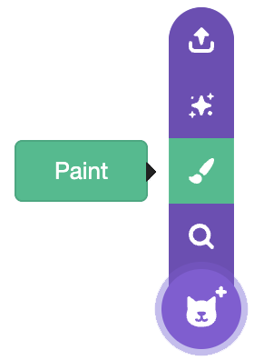
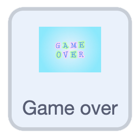
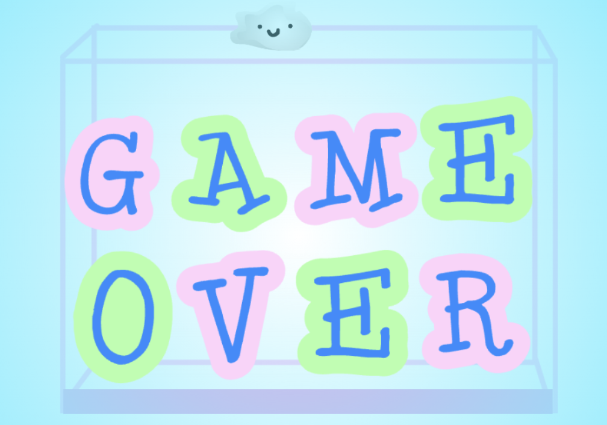

## Add a game over

Make the game end when the fruit stack up too high.

--- task ---

{:width="150"}

At the bottom, inside the `forever`{:class="block3control"} loop, add another `if`{:class="block3control"} block.

Use a `more than`{:class="block3operators"} block, and drag the `y position`{:class="block3motion"} into the first box.

```blocks3
if <(costume [number v]) = (3)> then
if <touching color (#edd51c)?> then
change y by (-4.2)
wait (0.2) seconds
start sound (Squish Pop v)
delete this clone
end
end
+if <(y position) > ()> then
end
```

--- /task ---


--- task ---

In the second box, add the number you want to be the highest point. 

```blocks3
+if <(y position) > (111)> then
end
```

--- /task ---


--- task ---

If a fruit ends up higher than this number, `broadcast and wait`{:class="block3events"} a `Game over` message.

```blocks3
if <(y position) > (111)> then
+broadcast (Game over v) and wait
end
```

--- /task ---

--- task ---

Paint a new sprite and draw your **game over** screen.

{:width="200"}

--- /task ---

--- task ---

{:width="150"}

Give it a `green flag`{:class="block3events"} that hides it at the start.

```blocks3
when green flag clicked
hide
```

--- /task ---

--- task ---

Then make it show when it gets the `Game over` message. You can also add a `sound`{:class="block3sound"}.

```blocks3
when I receive (Game over v)
go to (front v) layer
show
play sound (Lose v) until done
stop (all v)
```

--- /task ---

**Test:** Click the green flag and fill the box until the fruit reach the top — your 'Game over' screen should appear and the game should stop.

{:width="450"}
