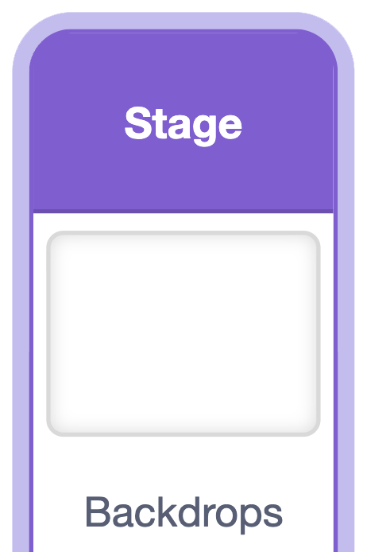

## More challenges

You've made a complete fruit-dropping game. Here are some more ways to make it your own. Try any that you like — each one is optional.

> [!TASK]
>
> ### Add music and backdrop
>
> {:width="150"}
>
> In the stage, choose a backdrop. 
>
> Then loop a `sound`{:class="block3sound"} track so your game has a soundtrack.
>
> ```blocks3
> when green flag clicked
> forever
> play sound (your track v) until done
> end
> ```


> [!TASK]
>
> ### Add a dropper sprite
>
> Add a sprite at the top that follows the mouse pointer, so the player can see where the next fruit will land. The example game uses a cloud. You could give yours eyes and a mouth to make it a character.
>
> You can use the `set x`{:class="block3motion"} block for this.
>
> ```blocks3
> when green flag clicked
> go to x: (-8) y: (159)
> forever
> set x to (mouse x)
> end
> ```

> [!TASK]
>
> ### Add a box or basket
>
> Draw a box or basket sprite for the fruit to fall into, and send it to the back so the fruit sit inside it.
>
> ```blocks3
> when green flag clicked
> go to (back v) layer
> ```

> [!TASK]
>
> ### Keep score
>
> Add a `score`{:class="block3variables"} variable to make it more of a game. 
>
> Set it to `0` when the flag is clicked, and `change score by`{:class="block3variables"} just before each `delete this clone`{:class="block3control"}. Give different fruit different points!
>
> ```blocks3
> change [score v] by (10)
> delete this clone
> ```


