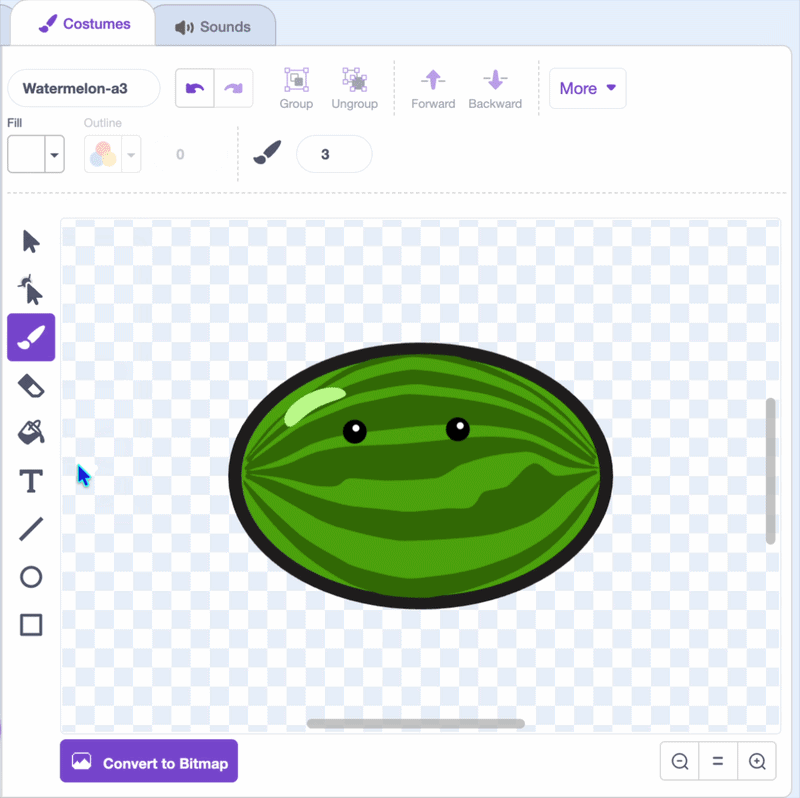
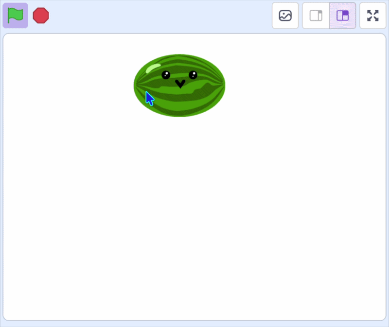

## Add your first fruit

In this step, you'll add the first piece of fruit and make it follow the mouse pointer, ready to drop.

--- task ---

[Start a new Scratch project](https://scratch.mit.edu/projects/editor/){:target="_blank"}.

--- /task ---

--- task ---

Delete the cat sprite.

{:width="300"}

--- /task ---


--- task ---

Choose a new sprite for your fruit — choose one from the library (or draw your own). It can be any fruit you like, or even an animal, or anything you want to see drop into the box. 

{:width="300"}

--- /task ---

--- task ---

Use the paint tools to give it some character: a pair of eyes and a mouth. Resize it so a few could fit in a box.

{:width="450"}

--- /task ---

--- task ---

{:width="150"}

Position your fruit near the top of the stage, and under a `green flag`{:class="block3events"} add a `go to x: () y: ()`{:class="block3motion"} block.

```blocks3
when green flag clicked
go to x: (0) y: (115)
```

--- /task ---

--- task ---

Make the fruit follow the mouse pointer. 

Wrap the `go to x: y:`{:class="block3motion"} block in a `forever`{:class="block3control"} loop, and change its `x`{:class="block3motion"} to the `mouse x`{:class="block3sensing"} position.

```blocks3
when green flag clicked
+forever
go to x: (mouse x) y: (115)
end
```

--- /task ---

--- task ---

Only move the fruit while the mouse is held down. First, wrap the `go to x: y:`{:class="block3motion"} block in an `if () then`{:class="block3control"} block.

```blocks3
when green flag clicked
forever
+if <> then
go to x: (mouse x) y: (115)
end
end
```

--- /task ---

--- task ---

Now drop a `mouse down?`{:class="block3sensing"} block into the hexagon slot of the `if`{:class="block3control"} block.

```blocks3
when green flag clicked
forever
+if <mouse down?> then
go to x: (mouse x) y: (115)
end
end
```

--- /task ---

--- task ---

Stop players from dragging your fruit around the stage. Add a `set drag mode [not draggable v]`{:class="block3sensing"} block to the top of your `when green flag clicked`{:class="block3events"} blocks.

```blocks3
when green flag clicked
+set drag mode [not draggable v]
forever
if <mouse down?> then
go to x: (mouse x) y: (115)
end
end
```

--- /task ---

**Test:** Click the green flag, then click on the stage. Your fruit follows the mouse pointer left and right, but stays at the same height.

{:width="450"}
