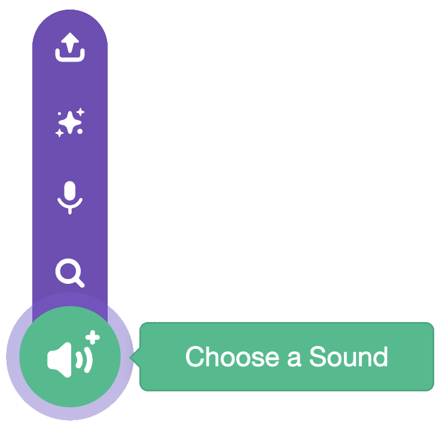

## Clone the fruit

The fruit you drop are **clones**, which are copies of the sprite that appear every time the mouse is clicked.

> [!TASK]
>
> {:width="150"}
>
> Add a `create clone`{:class="block3control"} block that makes a copy every time the mouse is clicked. There is a short `wait`{:class="block3control"} so you don't get hundreds appearing at once.
>
> Take the `go to x: y:`{:class="block3motion"} block out — the clone will use it next.
>
> ```blocks3
> when green flag clicked
> set drag mode [not draggable v]
> forever
> if <mouse down?> then
> +create clone of (myself v)
> +wait (0.1) seconds
> end
> end
> ```

> [!TASK]
>
> Tell each clone what to do when it appears. 
>
> Add a `when I start as a clone`{:class="block3control"} block, and drag back in the `x: y:`{:class="block3motion"} position.
>
> ```blocks3
> when I start as a clone
> go to x: (mouse x) y: (115)
> ```

> [!TASK]
>
> Choose a sound for when you drop the fruit. 
>
> First, add a new sound in the **Sounds tab**. 
>
> {:width="450"} 

> [!TASK]
>
> Click choose a sound and select one from the library.
>
> {:width="200"} 

> [!TASK]
>
> Then add a `start sound`{:class="block3sound"} block and select your sound from the drop-down menu.
>
> ```blocks3
> when I start as a clone
> go to x: (mouse x) y: (115)
> +start sound (Pop v)
> ```

**Test:** click the green flag, then click on the stage to check that a new piece of fruit appears with a pop sound.


{:width="450"}
