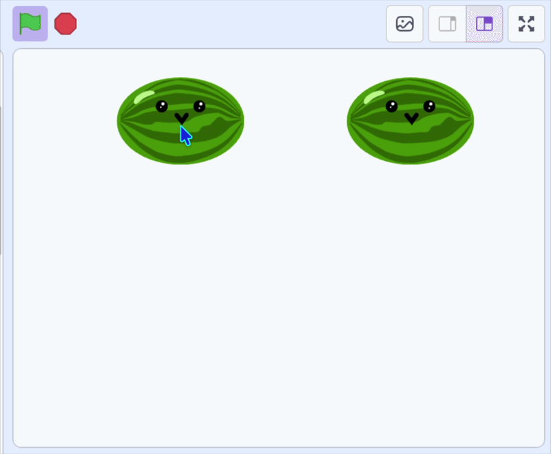

## Clone the fruit

The fruit you drop are **clones**, which are copies of the sprite that appear every time the mouse is clicked.

--- task ---


In the fruit sprite change your `green flag`{:class="block3events"} to create a clone. 

Add a `create clone of (myself)`{:class="block3control"} block that makes a copy every time the mouse is clicked. There is a short `wait`{:class="block3control"} so you don't get hundreds appearing at once.

Take the `go to x: y:`{:class="block3motion"} block out — the clone will use it next.

```blocks3
when green flag clicked
forever
if <mouse down?> then
create clone of (myself v)
wait (0.1) seconds
end
end
```

--- /task ---

--- task ---

Tell each clone what to do when it appears. 

Add a `when I start as a clone`{:class="block3control"} block, with the `x: y:`{:class="block3motion"} position and add a `sound`{:class="block3sound"}. 

Use the `Pop` sound or choose a sound you like from the sound library.

```blocks3
when I start as a clone
go to x: (mouse x) y: (115)
start sound (Pop v)
```

--- /task ---

**Test:** click the green flag, then click on the stage to check that a new piece of fruit appears with a pop.


