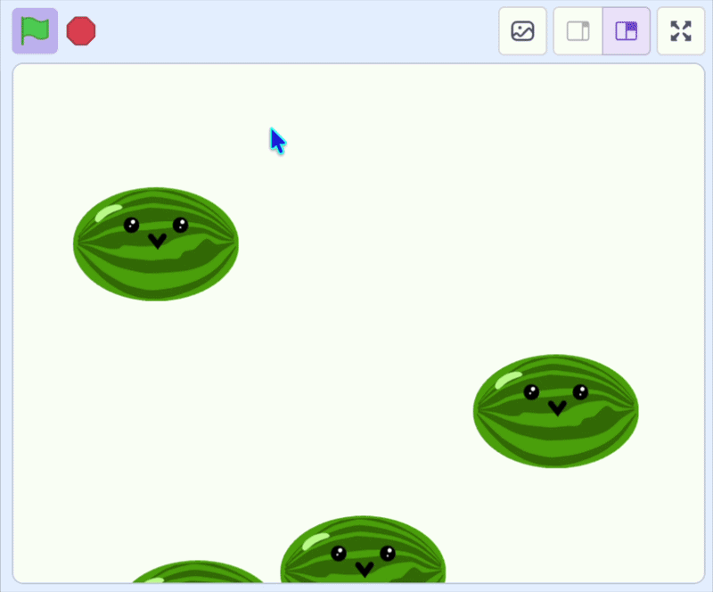

## Make it fall

In this step, you'll make each clone fall down the screen.

--- task ---

Go to your fruit sprite's `when I start as a clone`{:class="block3control"} script. Add a `forever`{:class="block3control"} loop that makes the clone fall by changing its `y`{:class="block3motion"} position again and again.

```blocks3
when I start as a clone
go to x: (mouse x) y: (115)
start sound (Pop v)
+forever
change y by (-4)
end
```



--- /task ---

--- task ---

Click the green flag and drop some fruit. The clones fall — but the original fruit shows at the top too, not moving. Add a `show`{:class="block3looks"} block to the clone so each copy appears as it drops.

```blocks3
when I start as a clone
go to x: (mouse x) y: (115)
start sound (Pop v)
+show
forever
change y by (-4)
end
```

--- /task ---

--- task ---

Now hide the original fruit so only the falling clones show. Add a `hide`{:class="block3looks"} block to the top of your `when green flag clicked`{:class="block3events"} script.

```blocks3
when green flag clicked
+hide
forever
if <mouse down?> then
create clone of (myself v)
wait (0.1) seconds
end
end
```

--- /task ---

Click the green flag and drop some fruit. Each piece falls down the screen, and the original is hidden.
