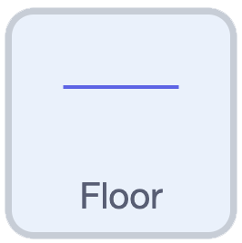

## Make them land

Your fruit falls straight off the bottom of the screen. In this step, you'll add a floor and make the fruit land on it.

--- task ---

Add a new sprite. Choose **Paint** to draw your own, then draw a line or a solid rectangle across the middle of the paint area. This will be the floor your fruit rests on.

Name the sprite `Floor`.



--- /task ---

--- task ---

Move the `Floor` sprite to the bottom of the stage. Add a `when green flag clicked`{:class="block3events"} block and a `go to x: () y: ()`{:class="block3motion"} block to set its position.

```blocks3
when green flag clicked
go to x: (7) y: (-125)
```

> You can change these numbers to move your floor higher or lower — drag the sprite where you want it and Scratch fills in the `x`{:class="block3motion"} and `y`{:class="block3motion"} for you.

--- /task ---

--- task ---


Now go to your fruit sprite. Inside the `forever`{:class="block3control"} loop of your `when I start as a clone`{:class="block3control"} script, check whether the clone is `touching (Floor v)?`{:class="block3sensing"}. If it is, nudge it back up so it settles on top instead of sinking through.

```blocks3
forever
change y by (-4)
+if <touching (Floor v)?> then
change y by (4.1)
end
end
```

--- /task ---

> The fruit falls by 4 each time, then jumps back up by 4.1 when it touches the floor. Those two numbers almost cancel out, so the fruit wobbles gently on the surface instead of falling through or bouncing away.


Click the green flag and drop some fruit. It falls and lands on the floor.
