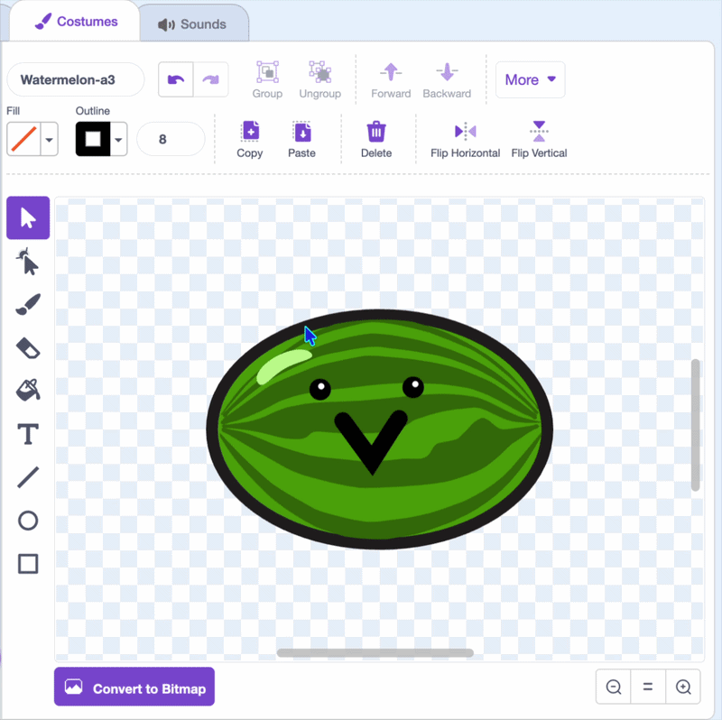
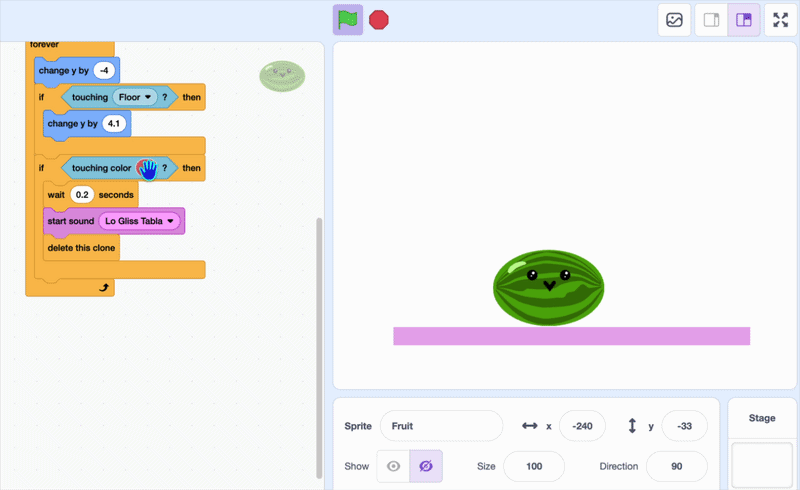
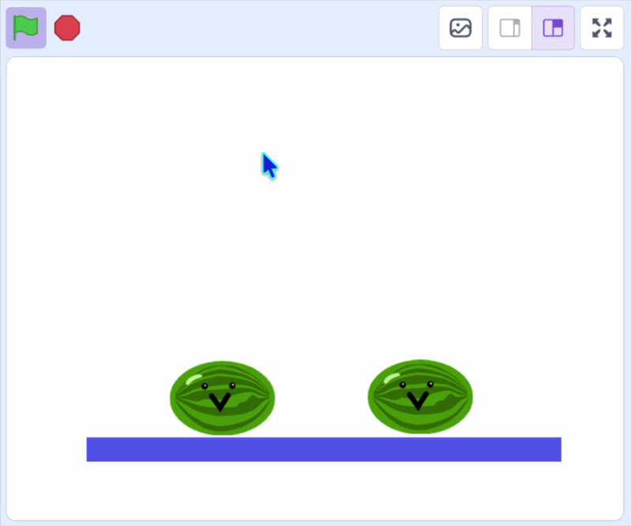

## Make the fruit disappear

Now for the interactive bit! When two of the fruit collide, they disappear.

This can be done using the `touching color`{:class="block3sensing"} block.

--- task ---
 


In the fruit sprite give your fruit a solid outline so Scratch can spot when two are touching. 

In the **paint editor**, change the outline to match the main fruit colour, or draw an outline in one colour all the way around the edge.



--- /task ---

--- task ---

Add an `if` and `touching color`{:class="block3sensing"} block inside the `forever`{:class="block3control"} loop. It plays a sound, then disappears with `delete this clone`{:class="block3control"}.

```blocks3
when I start as a clone
go to x: (mouse x) y: (115)
start sound (Pop v)
show
forever
change y by (-4)
if <touching (Floor v)?> then
change y by (4.1)
end
+if <touching color (#4e9a06)?> then
change y by (-4.2)
wait (0.2) seconds
start sound (Lo Gliss Tabla v)
delete this clone
end
end
```

**Tip:** The `wait`{:class="block3control"} block gives the fruit already sitting there a moment to detect the colour too, which means they both disappear.

--- /task ---

--- task ---

To get the exact colour, click the colour box in `touching color`{:class="block3sensing"}, choose the eyedropper to select from your fruit.



--- /task ---

**Test:** click the green flag and drop two fruit in the same place. When they touch, they should make a sound and disappear.



