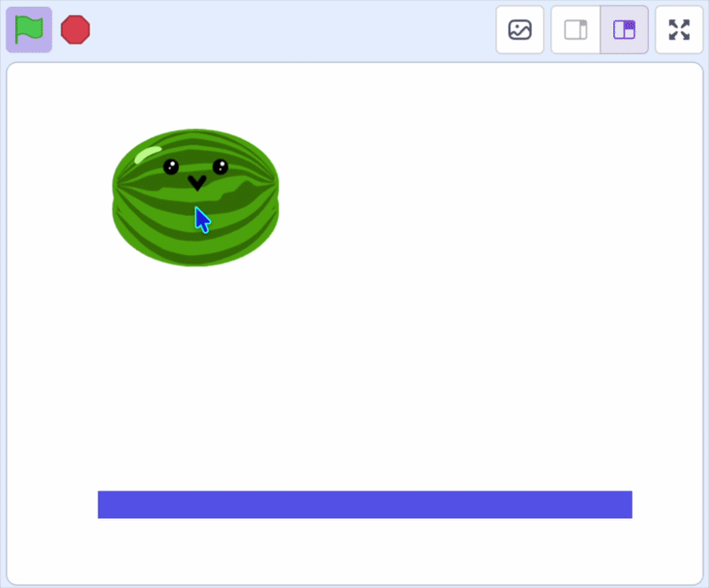

## Make it land

The fruit still falls straight through the floor. In this step, you'll make it stop when it lands.

--- task ---

Go to your fruit sprite. Inside the `forever`{:class="block3control"} loop of your `when I start as a clone`{:class="block3control"} script, check whether the clone is `touching (Floor v)?`{:class="block3sensing"}. If it is, nudge it back up so it settles on top instead of sinking through.

```blocks3
forever
change y by (-4)
+if <touching (Floor v)?> then
change y by (4.1)
end
end
```

--- /task ---

> The fruit falls by 4 each time, then jumps back up by 4.1 when it touches the floor. Those two numbers almost cancel out, so the fruit wobbles gently on the surface instead of falling through or bouncing away.



Click the green flag and drop some fruit. It falls and lands on the floor. If it sinks or bounces oddly, adjust your `Floor` sprite or the numbers a little.
