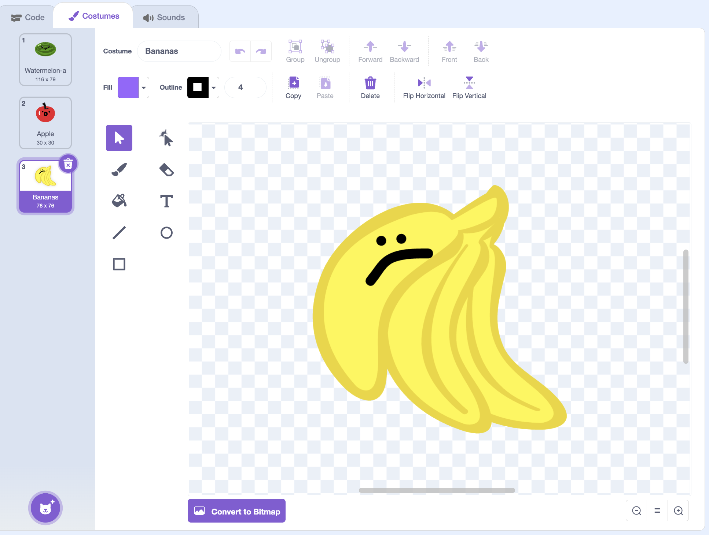

## Add more fruit

In this step, you'll add more fruit!

--- task ---

{:width="150"}

Click the **Costumes** tab for your fruit sprite and add a new costume for each new kind of fruit you want. To keep it simple, try adding one or two more to start with.

--- /task ---

--- task ---

Make sure the new fruit have a **solid outline of one colour** all the way around, just like your first fruit.

{:width="300"}

--- /task ---

> [!TIP]
>
> If your sprite came with extra costumes you don't want, delete them. Otherwise they'll turn up in the game too.

--- task ---

Now `switch costume`{:class="block3looks"} to `random`{:class="block3operators"} before the clone shows, so that a different fruit appears each time.

Fill in the random numbers for the number of costumes you have.

```blocks3
when I start as a clone
+switch costume to (pick random (1) to (3))
go to x: (mouse x) y: (115)
start sound (Pop v)
show
forever
change y by (-4)
if <touching (Floor v)?> then
change y by (4.1)
end
if <touching color (#4e9a06)?> then
change y by (-4.2)
wait (0.2) seconds
start sound (Lo Gliss Tabla v)
delete this clone
end
end
```

--- /task ---

**Test:** Click the green flag and click the mouse to check if a random one of your fruit appears each time.
