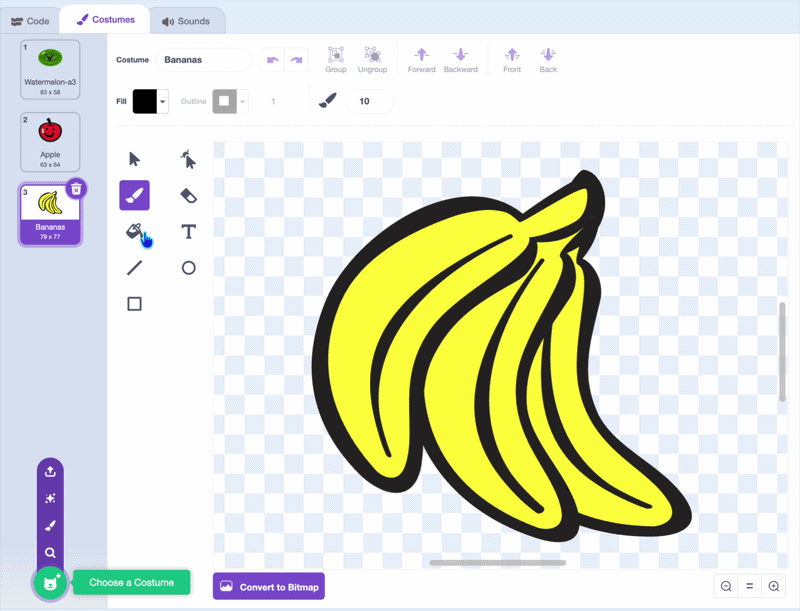

## Add more fruit

A game with only one fruit is a bit dull. In this step, you'll add more fruit and drop a random one each time.

--- task ---

Click the **Costumes** tab for your fruit sprite. Add a new costume — choose another fruit, draw your own, or duplicate the first one and change it. Give it eyes, and make sure it has a **solid outline of one colour** all the way around, just like your first fruit.

Add a third costume the same way, so you have three different fruit.



--- /task ---

--- task ---

Now drop a random fruit each time. At the top of your `when I start as a clone`{:class="block3control"} script, add a block to `switch costume to ()`{:class="block3looks"} a random one using `pick random () to ()`{:class="block3operators"}.

```blocks3
when I start as a clone
+switch costume to (pick random (1) to (3))
go to x: (mouse x) y: (115)
start sound (Pop v)
```

--- /task ---

Click the green flag and drop some fruit. A random one of your three fruit appears each time.
