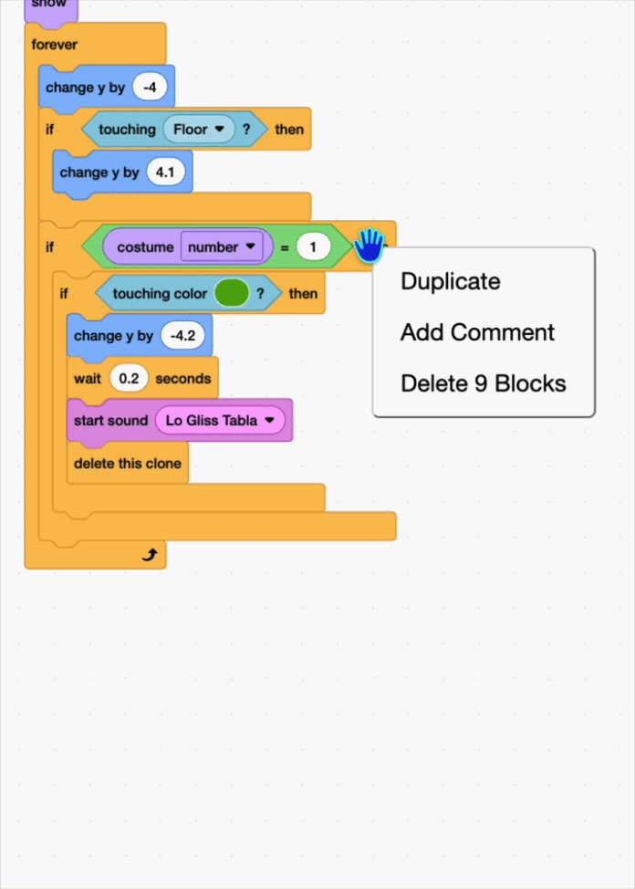

## Make every fruit disappear

Your fruit only disappear when they touch the green one — none of the other colours do anything yet.

In this step, you'll make every fruit disappear with its own kind.

--- task ---

{:width="150"}

In the fruit sprite add another `if`{:class="block3control"} block and move the wrap `if`{:class="block3control"} with `touching colour`{:class="block3sensing"} into it. 

```blocks3
+if < > then
if <touching color (#4e9a06)?> then
change y by (-4.2)
wait (0.2) seconds
start sound (Lo Gliss Tabla v)
delete this clone
end
end
```

--- /task ---

--- task ---

{:width="150"}

Use an `equals`{:class="block3operators"} and drag in the `costume number`{:class="block3looks"}. This will check if the costume number is `1`. 

```blocks3
+if <(costume [number v]) = (1)> then
if <touching color (#4e9a06)?> then
change y by (-4.2)
wait (0.2) seconds
start sound (Lo Gliss Tabla v)
delete this clone
end
end
```

--- /task ---

--- task ---

Right-click and **duplicate** the block, so you can add this for all the fruits. The new blocks should be under the last one, and inside the `forever`{:class="block3control"}.

{:width="450"}

--- /task ---

--- task ---

Change the `equals`{:class="block3operators"} to `2` and use the eyedropper for the colour of your **second** costume. You can also choose a different sound if you want.

```blocks3
if <(costume [number v]) = (1)> then
if <touching color (#4e9a06)?> then
change y by (-4.2)
wait (0.2) seconds
start sound (Lo Gliss Tabla v)
delete this clone
end
end
+if <(costume [number v]) = (2)> then
if <touching color (#ec1c2c)?> then
change y by (-4.2)
wait (0.2) seconds
start sound (Chomp v)
delete this clone
end
end
```

--- /task ---

--- task ---

Then duplicate it once more for your **third** fruit. Add `equals`{:class="block3operators"} to `3`, and eyedrop for that colour.

```blocks3
if <(costume [number v]) = (2)> then
if <touching color (#ec1c2c)?> then
change y by (-4.2)
wait (0.2) seconds
start sound (Chomp v)
delete this clone
end
end
+if <(costume [number v]) = (3)> then
if <touching color (#edd51c)?> then
change y by (-4.2)
wait (0.2) seconds
start sound (Squish Pop v)
delete this clone
end
end
```
--- /task ---


> [!TIP]
>
> It's easy to lose track of the blocks. Right-click and choose **Add Comment** to label each one with its fruit's name.

{:width="450"}

Click the green flag to **test**. Each fruit should disappear when they touch another of the same colour. 
