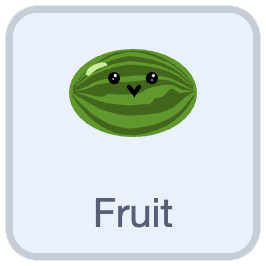
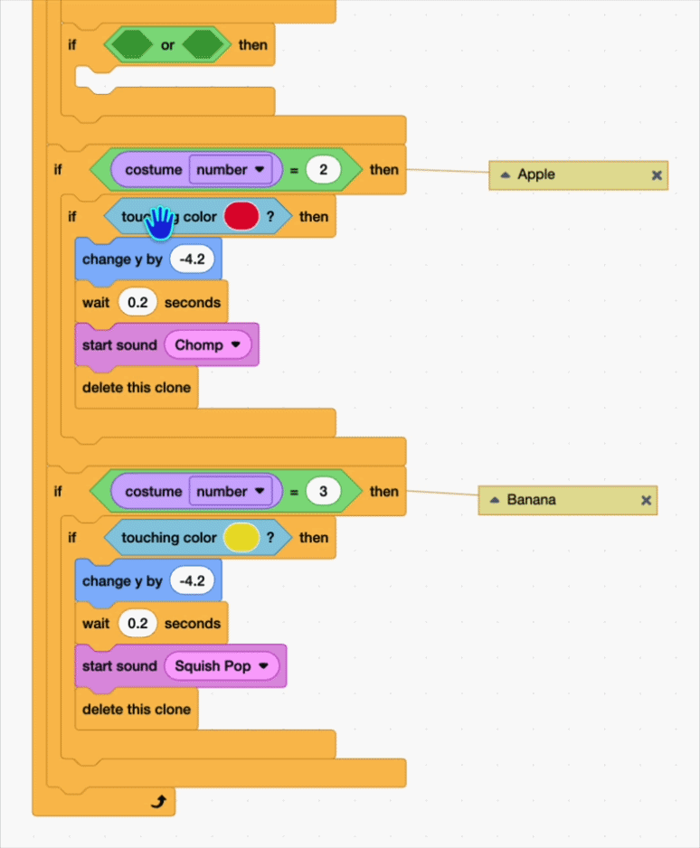
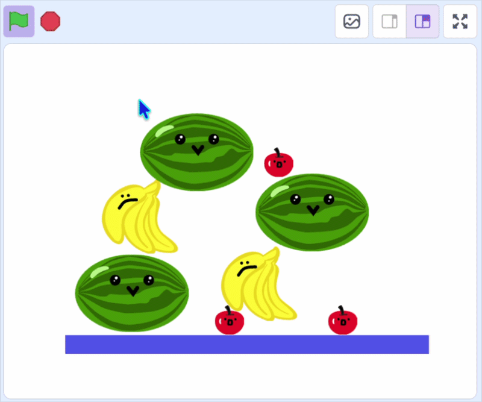

## Make the fruit stack

In this step, you'll make the fruit stack up when they don't match, so the box can fill.


> [!TASK]
>
> {:width="150"}
>
> For the first fruit costume, add an another `if`{:class="block3control"} block inside the `costume number`{:class="block3looks"} check.
>
> ```blocks3
> if <(costume [number v]) = (1)> then
> if <touching color (#4e9a06)?> then
> change y by (-4.2)
> wait (0.2) seconds
> start sound (Lo Gliss Tabla v)
> delete this clone
> end
> +if <> then
> end
> end
> ```

> [!TASK]
>
> Drag over an `or`{:class="block3operators"} block.
>
> ```blocks3
> if <(costume [number v]) = (1)> then
> if <touching color (#4e9a06)?> then
> change y by (-4.2)
> wait (0.2) seconds
> start sound (Lo Gliss Tabla v)
> delete this clone
> end
> +if <<> or <>> then
> end
> end
> ```

> [!TASK]
>
> Then add `touching color`{:class="block3sensing"} blocks for **all your other fruits**.
>
> ```blocks3
> if <(costume [number v]) = (1)> then
> if <touching color (#4e9a06)?> then
> change y by (-4.2)
> wait (0.2) seconds
> start sound (Lo Gliss Tabla v)
> delete this clone
> end
> +if <<touching color (#ec1c2c)?> or <touching color (#edd51c)?>> then
> end
> end
> ```
>
> To make sure you get the right colours, you can duplicate the colour blocks you did in the last step.
>
> {:width="350"}


> [!TASK]
>
> Then `change y`{:class="block3motion"} so the fruit stacks on top of another fruit in the same way as with the **Floor**. 
>
> ```blocks3
> if <(costume [number v]) = (1)> then
> if <touching color (#4e9a06)?> then
> change y by (-4.2)
> wait (0.2) seconds
> start sound (Lo Gliss Tabla v)
> delete this clone
> end
> if <<touching color (#ec1c2c)?> or <touching color (#edd51c)?>> then
> +change y by (4.1)
> end
> end
> ```


> [!TASK]
>
> Do the same for your other two costumes, changing the two colours for the **two other** fruit.

> [!TIP]
>
> If you are using more than 3 fruits, you will need to add the `touching color`{:class="block3sensing"} blocks for each extra fruit. You can embed more `or`{:class="block3operators"} blocks to do this.

**Test:** Click the green flag to see if different fruit now stack up into a pile, and matching fruit still disappear.

{:width="450"}
