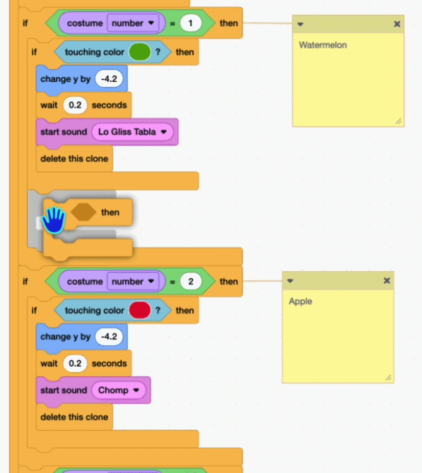
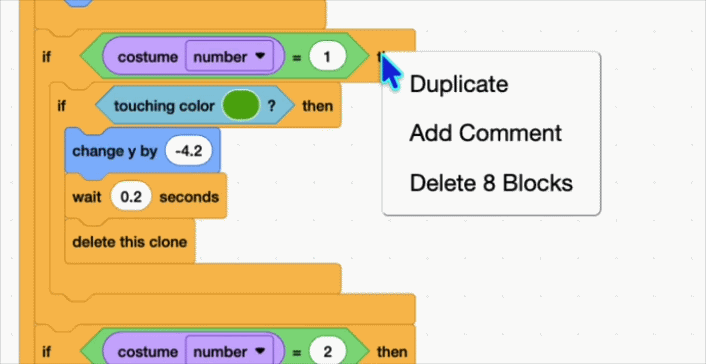

## Pop by colour

At the moment every fruit pops against every other colour. In this step, you'll make each fruit only pop with its **own** kind.

--- task ---

Wrap your pop code in a check for which costume the clone is wearing. Put the `touching color ()?`{:class="block3sensing"} code you built in step 7 inside an `if (costume number) = (1)`{:class="block3control"} block, using the `costume ()`{:class="block3looks"} reporter and the `=`{:class="block3operators"} operator.

```blocks3
+if <(costume [number v]) = (1)> then
if <touching color (#4e9a06)?> then
change y by (-4.2)
wait (0.2) seconds
start sound (Lo Gliss Tabla v)
delete this clone
end
end
```

--- /task ---

--- task ---

Right-click the `if (costume number) = (1)`{:class="block3control"} block and choose **Duplicate** to make a copy for your second fruit. Change the costume number to `2`, eyedrop the colour of your **second** costume into its `touching color ()?`{:class="block3sensing"} block, and choose a different sound.

Then duplicate it once more for your third fruit: costume number `3`, its colour, and its own sound.

```blocks3
+if <(costume [number v]) = (2)> then
if <touching color (#ec1c2c)?> then
change y by (-4.2)
wait (0.2) seconds
start sound (Chomp v)
delete this clone
end
end
+if <(costume [number v]) = (3)> then
if <touching color (#edd51c)?> then
change y by (-4.2)
wait (0.2) seconds
start sound (Squish Pop v)
delete this clone
end
end
```



--- /task ---

> The colours shown here are just an example — use the eyedropper to pick the real colour of each of your costumes.

> **Tip:** it's easy to lose track of which check is which. Right-click a block and choose **Add Comment** to label each one with its fruit's name.



Click the green flag and drop lots of fruit. Now each fruit only pops when it touches another of its own kind.
